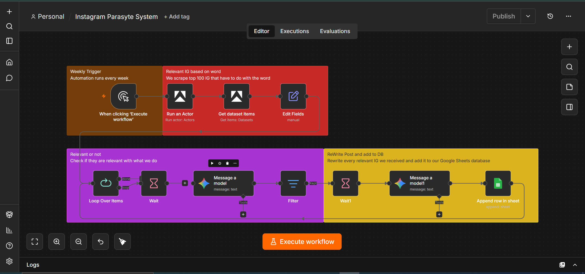

# Never Run Out of Content Ideas Again

Staring at a blank caption box every week is a productivity killer. This workflow watches an Instagram account in your niche, filters for what's actually relevant, and hands you a fresh, rewritten draft in your own angle — sitting in a spreadsheet, ready to post or polish.

## Who is this for?

Content creators, marketers, and founders in a fast-moving niche — AI, tech, fitness, finance, anywhere trends move quickly — who want a constant stream of relevant content ideas without spending hours every week scrolling for inspiration.

## What problem is this solving?

Staying consistent on social media is hard when:

* You're manually scrolling for inspiration every time you sit down to post.
* By the time you spot a trending topic, it's already old news.
* Turning a trend into your own take takes longer than it should.

This workflow automates the idea-finding step entirely. It watches for what's trending in your space and gives you a ready-to-edit draft in your own voice, so you're never starting from zero.

## What this workflow does

1. **Runs on a schedule** (weekly, or as often as you set it) and pulls recent posts from a chosen account using Apify.
2. **Filters for relevance** — an AI classifier checks each post against your niche and skips anything off-topic.
3. **Rewrites relevant posts** into a fresh take in your own voice and angle.
4. **Logs everything to Google Sheets** — the source, the original, and your rewritten draft — all in one place, ready to review and post.

## Setup

1. Connect your accounts:
   * Apify (Instagram scraping)
   * Google Gemini API (relevance filtering + rewriting)
   * Google Sheets (draft storage)
2. Set your credentials in the respective nodes.
3. Set the account(s) you want to monitor in the "Run an Actor" node.
4. Replace the placeholder Google Sheet ID with your own.
5. Update the AI prompts with your niche, background, and tone — the better the prompt reflects your voice, the better the drafts.

## How to customize this

* **Relevance criteria:** Tune the classifier prompt to your specific niche instead of a broad category.
* **Voice/tone:** Update the rewrite prompt with your own background and style so drafts actually sound like you.
* **Sources:** Point it at multiple accounts, or swap Instagram for any other platform Apify supports.
* **Notifications:** Add a Slack or email ping when a new draft is ready, instead of checking the sheet manually.
* **Cadence:** Run it daily instead of weekly if your niche moves fast enough to warrant it.

---

*This is the GitHub-safe version — no live credentials, target accounts, sheet IDs, or personal details included. Replace all placeholders with your own values before running it.*
